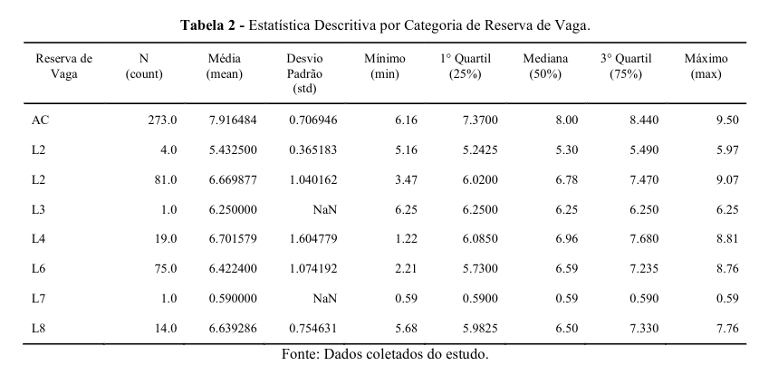
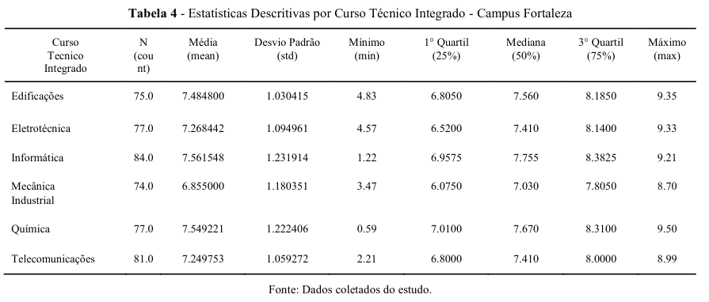
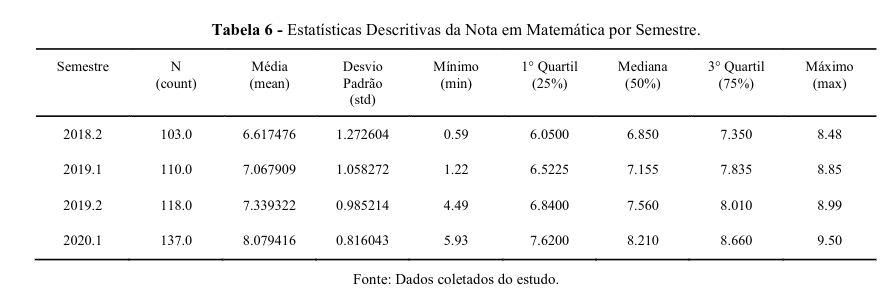
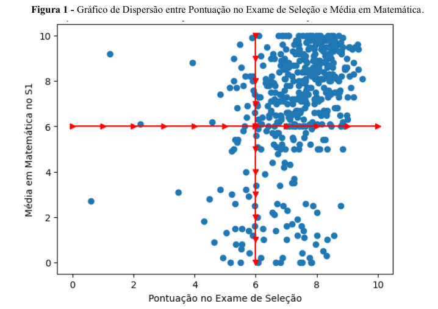
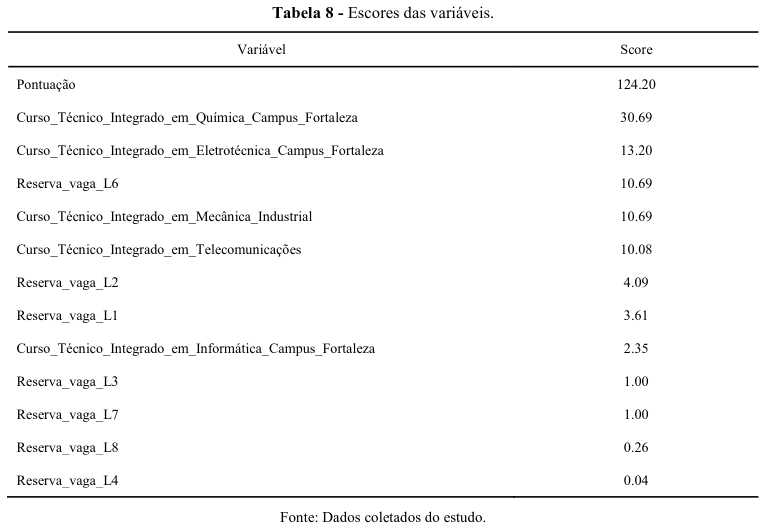
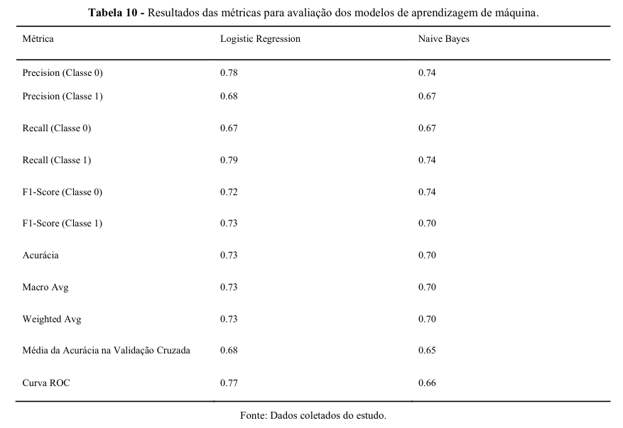

# Machine Learning: Uma aplicação para a prevenção da Evasão Escolar

### Resumo

O presente artigo aborda as probabilidades associadas à aprovação ou reprovação de alunos matriculados em displinas de matemática no primeiro semestre letivo com base em registro históricos de desempenho acadêmico como prova de seleção e fatores socioeconômicos. O artigo está fundamentado que a disciplina de matemática está relacionado com um índice de evasão escolar por conta de sua dificuldade entre os alunos.

**Os seguintes algoritmos de ML foram utilizados:**

1. Regressão Logística
2. Naive Bayes

**Base de Dados:**

1. Informações dos alunos ingressos nos cursos técnicos integrados no IFCE.
2. Contém 6 modalidades de cursos técnicos integrados no período de 2018.2 a 2020.1

Os dados foram coletados de forma manual com as informações de ingressos disponíveis publicamente no site do IFCE. Além disso, foi reunido as notas dos alunos por meio do sistema acadêmico da próprio instituto.

**Dicionário de Dados:**

| Variável        | Tipo        |Descrição                                                     | Valores Possíveis                                                                                                                                                                                                                                                                                                                 |
| --------------- | ----------- | ----------------------------- | ---------------------------------------------------------------
| Nota_Matemática | Número real | Média na disciplina de Matemática no primeiro semestre.       | 0 a 10                                                                                                                                                                                                                                                                                                                            |
| Pontuação       | Número real | Pontuação final no exame de seleção.                          | 0 a 10                                                                                                                                                                                                                                                                                                                            |
| Reserva_vaga    | String      | Tipo de reserva de vaga conforme critérios sociais e raciais. | - Ampla Concorrência    - L1: PcD, PPI, baixa renda, escola pública   - L2: PPI, baixa renda, escola pública   - L3: PcD, baixa renda, escola pública   - L4: Baixa renda, escola pública   - L5: PcD, PPI, escola pública   - L6: PPI, escola pública   - L7: PcD, escola pública   - L8: Escola pública |
| Curso           | String      | Curso técnico para o qual o aluno se inscreveu.               | - Técnico Integrado em Informática   - Técnico Integrado em Telecomunicações   - Técnico Integrado em Eletrotécnica   - Técnico Integrado em Química   - Técnico Integrado em Edificações   - Técnico Integrado em Mecânica Industrial                                                                             |
| Semestre        | String      | Semestre de ingresso no curso.                                | 2018.1, 2018.2, 2019.1, 2019.2, 2020.1, 2020.2, 2021.1, 2021.2, 2022.1, 2022.2                                                                                                                                                                                                                                                    |

Inicialmente tínhamos 682 alunos dos semestres entre 2018.2 até 2020.1, mas somente 468 alunos foram encontrados no sistema acadêmico, ou seja 214 não foram encontrados.

### **Metodologia:**

Os alunos foram separados em aprovados e reprovados. Como o número de aprovados são majoritários, existe um desbalanceamento que precisa ser tratado.

Para lidar com isso foram utilizado o algoritmo Synthetic Minority Oversampling Technique (SMOTE) para balancear as classes.

Critérios para classificação de notas binárias.

Aprovado: nota >= 5
Reprovado: nota < 6.

Limitações.

1. Conjunto de dados muito pequeno.
2. Informações socioeconômica dos alunos não estava preenchido na maioria dos casos.

### **Resultados:**

Na tabela acima, é possível ver que existe uma média maior entre os alunos da ampla concorrência do ambas categorias.

A maior média está presente no curso de informática.

As médias na disciplina de matemática aumentam a cada semestre.

É possível ver uma aglomeração de dados no canto superior direito, indicando que os aprovados com melhores notas na prova de seleção geralmente têm um índice de rendimento maior na disciplina de matemática.

Neste cenário, a variável com maior score é a pontuação da prova de seleção.

Precisão do Modelo para previsões.

### Conclusão

Com os dados apresentados, é possível notar uma discrepância entre os alunos de Ampla Concorrência e os alunos cotistas em seus índices de rendimento na disciplina de matemática.

Entretanto, a base de dados utilizada apresenta limitações significativas, como a escassez de informações em algumas categorias, onde há casos com apenas um aluno representando uma classe. Essa limitação compromete a representatividade e a robustez das análises realizadas.

Além disso, há uma evidente carência de dados relacionados ao impacto da disciplina de matemática na evasão escolar. Embora o artigo parta dessa premissa, não foram encontrados dados ou evidências que sustentem ou consolidem essa hipótese. Para estudos futuros, seria essencial ampliar a base de dados e incluir informações mais detalhadas que permitam explorar de forma mais consistente a relação entre o desempenho em matemática e a evasão escolar.

Danilo

@pereira2025machine ...
