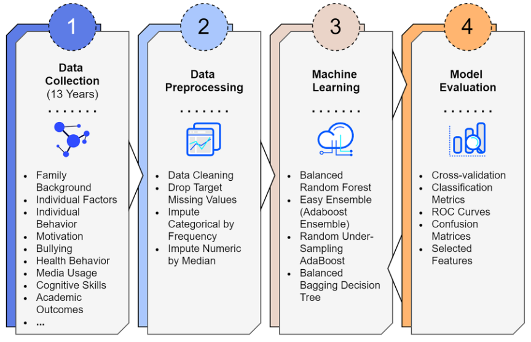
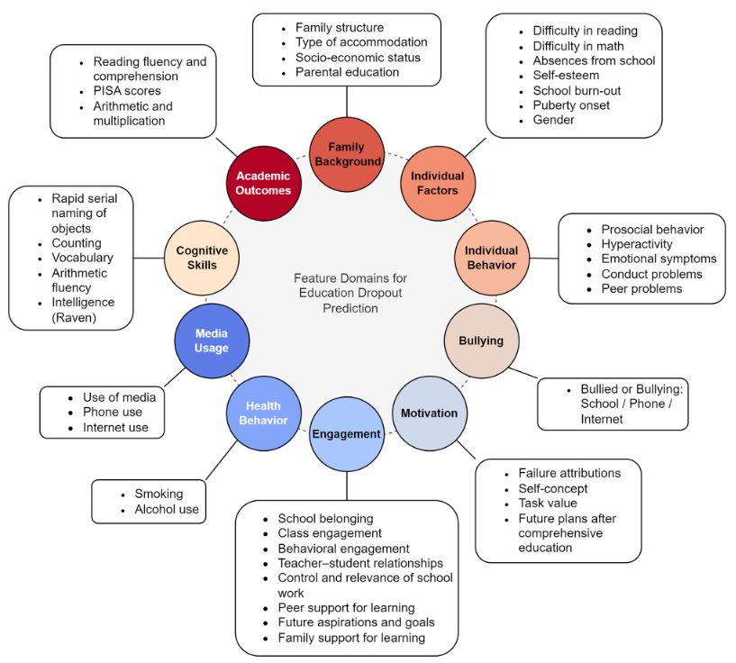
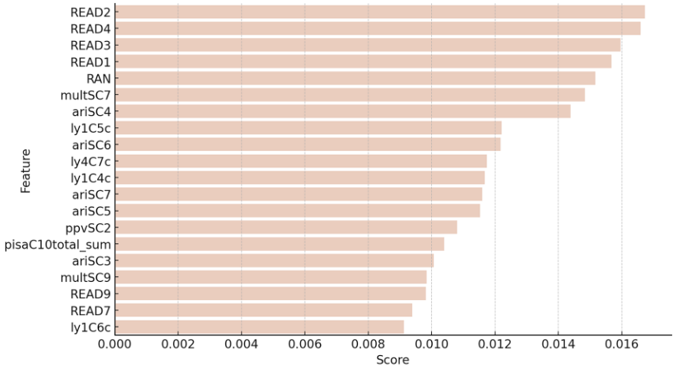

# Machine learning predicts upper secondary education dropout as early as the end of primary school

### Resumo

O artigo apresenta uma pesquisa que desenvolve modelos preditivos de evasão escolar no ensino médio da Finlândia utilizando algoritmos de aprendizado de máquina. A análise baseia-se em dados longitudinais coletados ao longo de treze anos, desde a pré-escola até o fim do ensino fundamental, abrangendo aspectos cognitivos, comportamentais, familiares e escolares dos alunos. O objetivo principal do estudo é investigar o quão cedo é possível prever, com precisão aceitável, quais estudantes têm maior probabilidade de abandonar o ensino médio.

## Metodologia

 

_Figura 1: Diagrama da metodologia utilizada_

 

### Coleta de Dados

O estudo utilizou dados longitudinais coletados ao longo de 13 anos, em três etapas distintas, com foco em prever a evasão escolar no ensino médio finlandês. Inicialmente, foram acompanhadas 2.000 crianças desde o jardim de infância até o final do ensino fundamental (9ª série). Posteriormente, a amostra foi expandida para 4.160 alunos ao incluir os estudantes que ingressaram no ensino médio, preservando os 2.000 participantes originais e adicionando novos estudantes para manter a representatividade populacional.

A divisão da coleta de dados segue a Tabela 1.

 

| Período      | Idade                                                     |
| :----------- | :-------------------------------------------------------- |
| Tempo 1 (T1) | Jardim de infância (6-7 anos)                             |
| Tempo 2 (T2) | Escola Primária e Ensino Médio Inferior (7 a 16 anos)     |
| Tempo 3 (T3) | Escola Secundária Geral e Profissionalizante (16-19 anos) |

_Tabela 1: Periodicidade dos dados coletados_

 

_Figura 2: Diagrama de domínio das features utilizadas_

 

Inicialmente foram analisadas 586 variáveis (Figura 2). No entanto, muitas dessas variáveis apresentavam valores ausentes. Portanto, na etapa de Processamento de Dados foram consideradas as seguintes medidas:

- Exclusão de variáveis com mais de 30% de dados ausentes, restando assim **311 features**;
- As variáveis foram codificadas através do one-hot encoding, que consiste em transformar variáveis categóricas como dados numéricos, criando colunas binárias para cada categoria;
- Para variáveis categóricas, os valores ausentes foram preenchidos com o valor mais frequente da respectiva variável;
- Para variáveis numéricas, foi calculada e utilizada a mediana;
- Para evitar que a imputação favorecesse desproporcionalmente os alunos que não evadiram (classe majoritária), os valores ausentes foram calculados a partir de um conjunto temporário balanceado, no qual o número de alunos evadidos e não evadidos foi igualado por meio de amostragem aleatória. Com base nesse grupo equilibrado, foram obtidos os valores mais frequentes (moda) para variáveis categóricas e as medianas para variáveis numéricas, garantindo uma imputação mais justa e representativa das duas classes.

### Aprendizagem de Máquina

Na etapa de aprendizado de máquina, foram testados 4 algoritmos de classificação para prever a evasão escolar com base nas 311 variáveis coletadas.

**Os algoritmos de Aprendizagem de Máquina avaliados foram:**

1. Balanced Random Forest (B-RandomForest)
2. Easy Ensemble (Adaboost Ensemble)
3. RSBoost (Adaboost modificado)
4. Bagging Decision Tree

Entre esses, o **Balanced Random Forest foi priorizado**, devido ao seu melhor desempenho preditivo em um conjunto de dados desbalanceado (com poucos casos de evasão). Esse modelo é uma variação do Random Forest (RF) tradicional, que combina diversas árvores de decisão independentes (aprendizes fracos) para formar um classificador mais robusto (aprendiz forte).

Em termos simples, o RF funciona construindo várias árvores, onde cada uma é treinada com uma amostra aleatória dos dados (bootstrap). Cada árvore aprende padrões distintos, e o resultado final do modelo é obtido por voto majoritário entre as árvores (modo), o que reduz o risco de overfitting (excesso de adaptação aos dados de treino).

Neste estudo, foram utilizados **100 estimadores** (árvores) com as configurações padrão da biblioteca scikit-learn, amplamente usada para implementação de modelos de machine learning em Python.

### Figuras de Mérito

Para avaliar a performance dos classificadores de aprendizado de máquina, o estudo utilizou um conjunto de métricas estatísticas essenciais:

- Acurácia (Accuracy)
- Precisão (Precision)
- Recall (Sensibilidade)
- Especificidade
- F1-Score
- Acurácia Balanceada (Balanced Accuracy)
- Média Macro de F1 e Precisão

Outras ferramentas métricas utilizadas incluem:

- Matriz de Confusão 2x2
- Pontuação AUC (Área Sob a Curva ROC)
- Validação Cruzada estratificada com 6 dobras

## Resultados

Entre os quatro classificadores testados, o Balanced Random Forest (B-RandomForest) foi o que apresentou melhor desempenho geral.

Embora outros modelos como o B-Bagging e o E-Ensemble tenham apresentado maior especificidade, eles falharam mais em identificar corretamente os alunos que evadiram, com menor recall e mais falsos negativos (Tabelas 2 e 3).

 

| Classificador  | Acurácia | Acurácia Balanceada | Recall | Precisão | F1-score |
| :------------- | :------- | :------------------ | :----- | :------- | :------- |
| E-Ensemble     | 0.616    | 0.596               | 0.555  | 0.580    | 0.572    |
| B-Boosting     | 0.596    | 0.571               | 0.517  | 0.550    | 0.547    |
| B-Bagging      | 0.660    | 0.550               | 0.318  | 0.541    | 0.539    |
| B-RandomForest | 0.611    | 0.607               | 0.599  | 0.582    | 0.573    |

_Tabela 2: Performance de cada classificador para dados até 9ª série_

 

| Classificador  | Acurácia | Balanced accuracy | Recall | Precisão | F1-score |
| :------------- | :------- | :---------------- | :----- | :------- | :------- |
| E-Ensemble     | 0.593    | 0.581             | 0.557  | 0.564    | 0.552    |
| B-Boosting     | 0.587    | 0.561             | 0.505  | 0.549    | 0.538    |
| B-Bagging      | 0.639    | 0.531             | 0.302  | 0.532    | 0.531    |
| B-RandomForest | 0.589    | 0.588             | 0.587  | 0.569    | 0.554    |

_Tabela 3: Performance de cada classificador para dados até 6ª série_

 

A análise da importância dos atributos mostrou que as variáveis mais preditivas pertencem principalmente a dois grupos:

- Resultados acadêmicos (fluência e compreensão de leitura, aritmética e multiplicação)
- Habilidades cognitivas (como nomeação automatizada rápida e vocabulário no jardim de infância)

_Figura 3: 20 features mais bem classificadas para o B-RandomForest usando dados até o 9º ano_

As Top 5 características listadas referem-se a:

1. READ2 = Fluência de leitura, 2º ano
2. READ4 = Fluência de leitura, 4º ano
3. READ3 = Fluência de leitura, 3º ano
4. READ1 = Fluência de leitura, 1º ano
5. RAN = Nomeação Automatizada Rápida, Jardim de Infância

Seguem as demais:

multSC7 = Multiplicação, 4º ano; ariSC4 = Aritmética, 1º ano (primavera); ly1C5C = Compreensão de leitura, 2º ano; ariSC6 = Aritmética, 3º ano; ly4C7C = Compreensão de leitura, 4º ano; ly1C4C = Compreensão de leitura, 1º ano; ariSC7 = Aritmética, 4º ano; ariSC5 = Aritmética, 2º ano; ppvSC2 = Vocabulário, Jardim de Infância; pisaC10total_sum = PISA, 9º ano; ariSC3=Aritmética, 1º ano (outono); multSC9 = Multiplicação, 7º ano; READ9 = Fluência de leitura, 9º ano; READ7 = Fluência de leitura, 7º ano; ly1C6C = Compreensão de leitura, 3º ano.

É importante destacar que esses dados são referentes ao contexto da Finlândia e não garante mesmo comportamento no Brasil.

## Conclusão

Este estudo representa um avanço na previsão da evasão escolar, utilizando dados longitudinais de 13 anos (desde o jardim de infância até o ensino médio) para construir modelos preditivos. O classificador Balanced Random Forest demonstrou eficácia na identificação precoce de alunos em risco, mantendo uma performance robusta mesmo com dados limitados à 6ª série. Os resultados indicam que variáveis relacionadas ao desempenho acadêmico e às habilidades cognitivas nas séries iniciais (1ª a 4ª) são os preditores mais relevantes para a evasão escolar.

Além disso, o estudo evidencia a importância de considerar a evasão como uma medida abrangente de graduação no longo prazo, o que possibilita a identificação de alunos com maior risco de enfrentar dificuldades posteriores no mercado de trabalho. Entre os desafios metodológicos, destacam-se o desequilíbrio de classes e a alta dimensionalidade dos dados, problemas superados parcialmente através do uso de técnicas específicas (como a Random Forest) e do tratamento rigoroso de dados ausentes.
