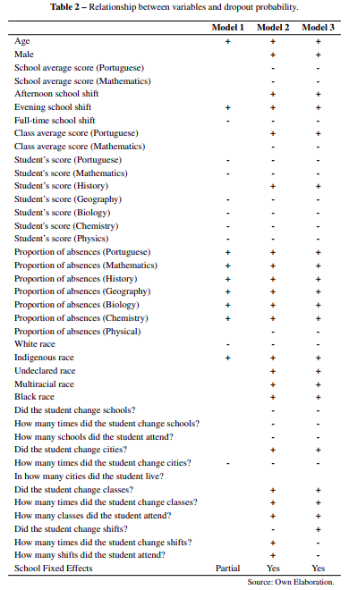
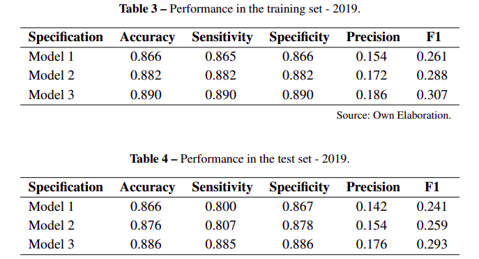
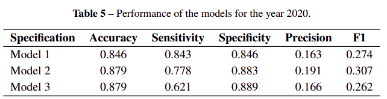
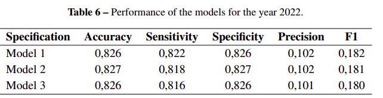

# An early warning system for school dropout in the state of espírito santo: a machine learning approach with variable selection methods

### Resumo

O principal objetivo do estudo foi construir um modelo de regressão logística para identificar alunos do **primeiro ano** do ensino médio da rede pública com risco de abandonar os estudos. 

Para a elaboração do modelo, os pesquisadores utilizaram um conjunto de dados confidenciais **de 2019 a 2022**, fornecidos pela *Secretaria de Estado da Educação do Espírito Santo (SEDU)* e pelo *Instituto Nacional de Estudos e Pesquisas Educacionais Anísio Teixeira (INEP)*. As informações dos alunos incluíam notas, frequência escolar, dados socioeconômicos, idade, sexo, turno escolar e histórico de mudanças de turma, escola ou cidade. 

## Metodologia

Foram empregados métodos de regularização como *LASSO, Ridge e Elastic-Net* para selecionar as variáveis mais relevantes e estimar os parâmetros do modelo. Os pesquisadores construíram três especificações de modelo distintas e as avaliaram em três estudos de caso,

**Caso 1**

Foram consideradas informações relativas apenas ao primeiro trimestre de 2019 para a predição do restante do ano. Desse modo, a tabela abaixo sumariza o o aumento "+" ou diminuição "-" do peso de cada feature de acordo com cada método de regularização, *LASSO, Ridge e Elastic-Net*, respectivamente.

Os resultados obtidos foram os seguintes:

**Caso 2**

Para realizar a predição do ano de 2020, foram utilizados os dados relativos ao primeiro trimestre do ano de 2019 (mesmo modelo do caso 1) e foram obtidas as seguintes métricas:

**Caso 3**

Predição de abandonos no ano de 2022 treinando o modelo com dados dos anos anteriores. Os resultados obtidos estão resumidos abaixo

Em suma, os casos 2 e 3 se assemelham à um cenário mais realista, dado que é desejável que seja utilizada uma quantidade maior de dados passados. Também é possível notar a variação na comparação do desempenho de cada modelo, portanto, ao selecionar um dos modelos, é necessário observar a pontação individual de cada um, priorizando a pontuação obtida na métrica mais adequada.